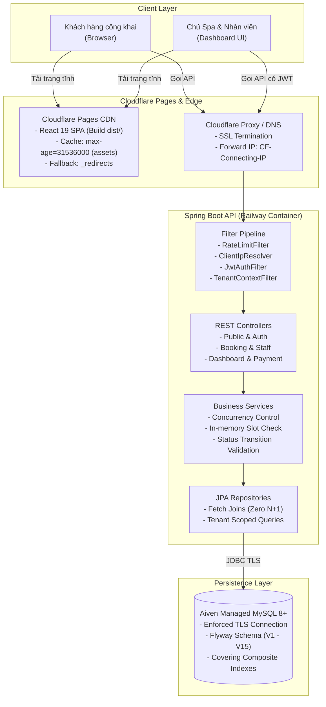
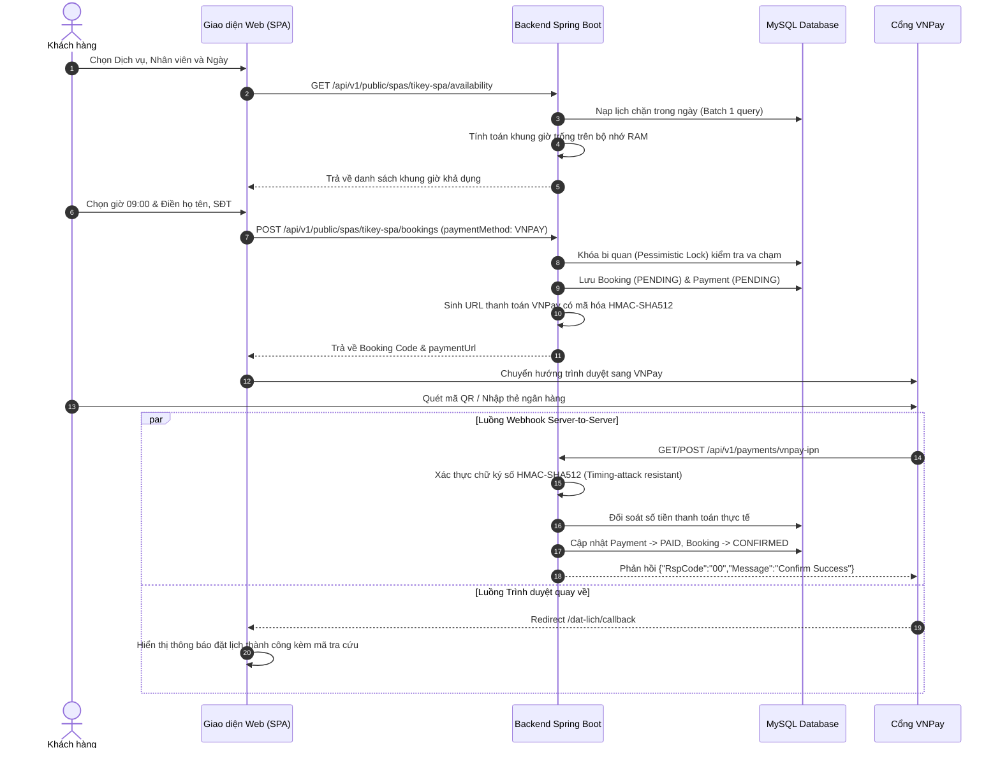
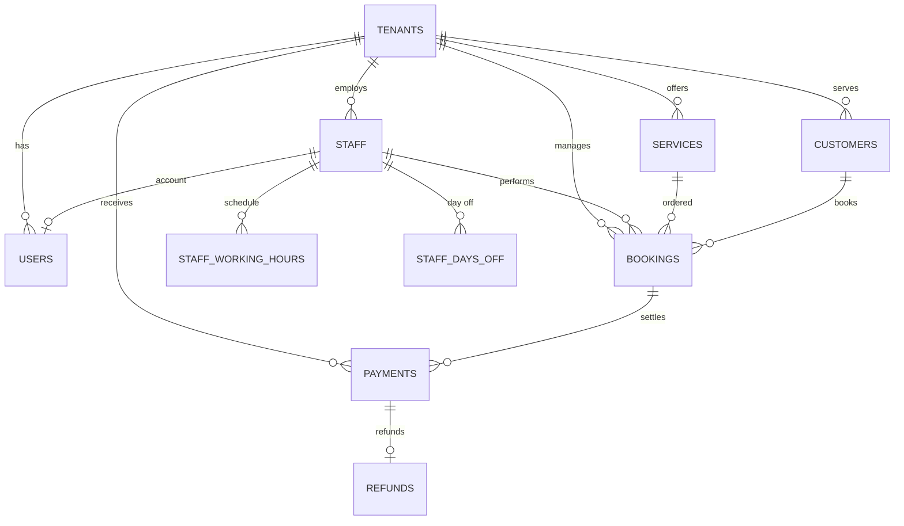

# TIKEY SPA — Hệ thống Đặt lịch & Quản lý Hoạt động Spa

[](https://adoptium.net/)
[](https://spring.io/projects/spring-boot)
[](https://react.dev/)
[](https://vitejs.dev/)
[](https://www.typescriptlang.org/)
[](https://tailwindcss.com/)
[](https://www.mysql.com/)
[](https://flywaydb.org/)

> **TIKEY SPA** là nền tảng quản lý và đặt lịch spa chuyên nghiệp, hỗ trợ khách hàng đặt lịch trực tuyến không cần tạo tài khoản, tích hợp thanh toán VNPay và cung cấp bộ công cụ vận hành toàn diện cho Chủ cơ sở (OWNER) cùng Nhân viên trị liệu (STAFF).

---

## 📑 Mục lục

1. [Vấn đề giải quyết & Đối tượng sử dụng](#-vấn-đề-giải-quyết--đối-tượng-sử-dụng)
2. [Tổng quan dự án & Định hướng Micro-SaaS](#-tổng-quan-dự-án--định-hướng-micro-saas)
3. [Demo trực tuyến](#-demo-trực-tuyến)
4. [Bảng tính năng hệ thống](#-bảng-tính-năng-hệ-thống)
5. [Công nghệ sử dụng](#-công-nghệ-sử-dụng)
6. [Kiến trúc hệ thống](#-kiến-trúc-hệ-thống)
7. [Các luồng nghiệp vụ chính](#-các-luồng-nghiệp-vụ-chính)
8. [Bảo mật và Phân quyền](#-bảo-mật-và-phân-quyền)
9. [Thiết kế Cơ sở dữ liệu](#-thiết-kế-cơ-sở-dữ-liệu)
10. [Cấu trúc thư mục](#-cấu-trúc-thư-mục)
11. [Yêu cầu môi trường & Cài đặt Local](#-yêu-cầu-môi-trường--cài-đặt-local)
12. [Bảng biến môi trường](#-bảng-biến-môi-trường)
13. [Tổng quan API RESTful](#-tổng-quan-api-restful)
14. [Kiểm thử và Chất lượng mã nguồn](#-kiểm-thử-và-chất-lượng-mã-nguồn)
15. [Hướng dẫn triển khai Production](#-hướng-dẫn-triển-khai-production)
16. [Hạn chế hiện tại & Định hướng tương lai](#-hạn-chế-hiện-tại--định-hướng-tương-lai)
17. [Tài liệu kỹ thuật chi tiết](#-tài-liệu-kỹ-thuật-chi-tiết)
18. [Bản quyền và Đóng góp](#-bản-quyền-và-đóng-góp)

---

## 🎯 Vấn đề giải quyết & Đối tượng sử dụng

### 1. Vấn đề thực tế
- **Đặt lịch thủ công kém hiệu quả**: Các spa vừa và nhỏ thường tiếp nhận lịch qua tin nhắn hoặc sổ sách, dễ dẫn đến tình trạng trùng lịch (double-booking), nhầm lẫn ca làm việc của kỹ thuật viên và thất thoát doanh thu.
- **Rào cản trải nghiệm khách hàng**: Bắt buộc khách phải tải ứng dụng hoặc đăng ký tài khoản rườm rà trước khi đặt lịch khiến tỷ lệ bỏ ngang đơn đặt dịch vụ tăng cao.
- **Thiếu tính minh bạch và bảo mật**: Khó kiểm soát doanh thu theo thời gian thực, thiếu phân quyền rành mạch giữa chủ cơ sở và kỹ thuật viên, đồng thời gặp khó khăn trong việc đối soát giao dịch thanh toán trực tuyến.

### 2. Đối tượng sử dụng
- **Khách hàng công khai**: Khách hàng tìm kiếm dịch vụ làm đẹp, trị liệu cổ vai gáy, massage; muốn xem giờ trống tức thì và đặt lịch nhanh chóng kèm mã tra cứu tự động.
- **Kỹ thuật viên / Chuyên viên trị liệu (STAFF)**: Nhân viên spa cần theo dõi lịch hẹn cá nhân được phân công, chấm công ca làm việc, đăng ký ngày nghỉ và cập nhật tiến độ phục vụ khách.
- **Chủ Spa / Quản lý cơ sở (OWNER)**: Người quản lý cần bảng điều khiển doanh thu tổng thể, phân công lịch hẹn, quản lý danh mục giá dịch vụ, nhân sự và đối soát dòng tiền thanh toán.

---

## 🏢 Tổng quan dự án & Định hướng Micro-SaaS

### 1. Phạm vi triển khai hiện tại (Single-Spa Product)
Ứng dụng đang vận hành phục vụ trực tiếp cho cơ sở **TIKEY SPA** với định danh thương hiệu mặc định (`slug = "tikey-spa"`). Mọi luồng khách hàng công khai truy cập qua giao diện web đều tương tác với dữ liệu của cơ sở này.

### 2. Sẵn sàng cho định hướng Micro-SaaS Đa Tenant (Future Vision)
Toàn bộ mã nguồn backend đã được thiết kế sẵn cấu trúc **Shared Database, Shared Schema Multi-Tenancy**:
- Mọi bảng dữ liệu quan hệ đều có khóa ngoại `tenant_id`.
- Tầng nghiệp vụ xử lý dữ liệu thông qua cơ chế `TenantContext` (ThreadLocal), tách biệt hoàn toàn truy vấn theo từng cơ sở spa.

> **Lưu ý minh bạch về phạm vi sản phẩm**:
> Dự án **chưa triển khai** cổng tự đăng ký spa (Self-service Tenant Onboarding), tính năng thanh toán thuê bao định kỳ (Subscription Billing), phân định tên miền riêng theo tenant (Custom Domain per Tenant) hay giao diện quản trị Super-Admin toàn hệ thống. Đây là các định hướng phát triển trong tương lai.

---

## 🔗 Demo trực tuyến

**Truy cập:** [https://spa-booking-system-dta.pages.dev](https://spa-booking-system-dta.pages.dev)

> 🔐 Dashboard OWNER và giao diện STAFF yêu cầu đăng nhập.
> Liên hệ tác giả để được cấp tài khoản demo.

---

## ⚡ Bảng tính năng hệ thống

Các tính năng được phân loại minh bạch dựa trên mã nguồn thực tế:

| Nhóm tính năng | Chi tiết chức năng | Mức độ hoàn thiện |
| :--- | :--- | :---: |
| **Khách hàng công khai** | - Xem thông tin spa, dịch vụ, bảng giá niêm yết, chuyên viên nổi bật.<br>- Kiểm tra khung giờ trống tự động theo thời gian thực.<br>- Đặt lịch nhanh không cần tài khoản; gửi email thông báo xác nhận.<br>- Tra cứu và hủy lịch hẹn bằng mã code độc nhất.<br>- Gửi góp ý phản hồi tới chủ spa (có Rate Limit chống spam). | **Đã triển khai** |
| **Quản trị OWNER** | - Dashboard chỉ số doanh thu thực tế, doanh thu dự kiến, biểu đồ 7 ngày.<br>- Quản lý danh mục dịch vụ, thời lượng, giá tiền và quy trình trị liệu.<br>- Quản lý hồ sơ nhân viên, tạo tài khoản, khóa tài khoản, đặt lại mật khẩu.<br>- Quản lý cấu hình ca làm việc trong tuần và phê duyệt ngày nghỉ nhân viên.<br>- Phân công/chỉ định lại nhân viên cho lịch hẹn (`PATCH /assign`).<br>- Quản lý hồ sơ khách hàng, xem lịch sử ghé spa.<br>- Xuất danh sách lịch hẹn, doanh thu, khách hàng ra file Excel (`.xlsx`). | **Đã triển khai** |
| **Phân quyền STAFF** | - Xem lịch làm việc và danh sách các ca hẹn cá nhân được phân công.<br>- Thao tác cập nhật vòng đời lịch hẹn: Check-in, Bắt đầu, Hoàn thành.<br>- Xem lịch trình cá nhân trong ngày (`GET /daily-schedule`).<br>- Tự cập nhật số điện thoại, email hồ sơ cá nhân.<br>- *Bảo mật*: Hoàn toàn bị ẩn doanh thu và bị cấm xem lịch của nhân viên khác. | **Đã triển khai** |
| **Đặt lịch & Vòng đời** | - Tính toán khung giờ trống bằng thuật toán lô (Batch calculation) cực nhanh.<br>- Pessimistic Locking chống đặt trùng giờ.<br>- Đầy đủ trạng thái: `PENDING`, `CONFIRMED`, `CHECKED_IN`, `IN_PROGRESS`, `COMPLETED`, `CANCELLED`, `NO_SHOW`.<br>- Nghiệp vụ đổi lịch hẹn (`Reschedule`) tự động kiểm tra lại điều kiện giờ trống. | **Đã triển khai** |
| **Thanh toán & Hoàn tiền** | - Tùy chọn 2 hình thức: Thanh toán tại Spa (`PAY_AT_SPA`) hoặc qua `VNPAY`.<br>- Tích hợp VNPay Sandbox: Tạo URL thanh toán an toàn, redirect client.<br>- Webhook VNPay IPN Server-to-Server: Xác thực chữ ký số HMAC-SHA512 kháng Timing Attack, chống xử lý lặp đơn hàng.<br>- Đối soát giao dịch QueryDR (`POST /payments/{id}/reconcile`).<br>- Nghiệp vụ hoàn tiền (`Refunds`) tự động tính tỷ lệ phí hủy lịch theo giờ. | **Đã triển khai** |
| **Bảo mật & Hiệu năng** | - Xác thực Stateless JWT (HMAC-SHA256) + Mã hóa BCrypt mật khẩu.<br>- Phân quyền RBAC (`ROLE_OWNER`, `ROLE_STAFF`).<br>- Tách biệt dữ liệu theo tenant qua `ThreadLocal` (`TenantContext`).<br>- Rate limiting theo IP thực (chống giả mạo IP qua Trusted Proxy).<br>- Tối ưu hóa bundle frontend với React.lazy (giảm 50.4% dung lượng tải ban đầu).<br>- Tối ưu hóa truy vấn CSDL: Batch slots check, fetch joins, 3 chỉ mục composite. | **Đã triển khai** |
| **Thông báo** | Gửi email xác nhận đặt lịch & nhắc lịch qua Resend API | Đã triển khai |
| **Mở rộng** | Tự đăng ký spa (Self-service Tenant Onboarding) | Dự kiến phát triển |
| **Mở rộng** | Tích hợp SMS Brandname / Zalo ZNS | Dự kiến phát triển |
| **Mở rộng** | Quản lý gói cước Micro-SaaS thuê bao (Subscription) | Dự kiến phát triển |

---

## 🛠️ Công nghệ sử dụng

### 1. Frontend Client
- **Framework**: [React 19.2.8](https://react.dev/) + [TypeScript 6.0](https://www.typescriptlang.org/)
- **Build Tool**: [Vite 8.3.0](https://vitejs.dev/) (Cấu hình route code-splitting qua `React.lazy`)
- **Định tuyến SPA**: [React Router DOM 7.18.4](https://reactrouter.com/)
- **Styling**: [Tailwind CSS 4.3.3](https://tailwindcss.com/)
- **Biểu tượng (Icons)**: [Lucide React 1.51.0](https://lucide.dev/)
- **HTTP Client**: [Axios 1.20.0](https://axios-http.com/)

### 2. Backend API
- **Nền tảng**: Java 17 LTS + [Spring Boot 4.1.1](https://spring.io/projects/spring-boot)
- **Bảo mật**: [Spring Security](https://spring.io/projects/spring-security) (Stateless JWT via `jjwt 0.12.5`)
- **Truy xuất dữ liệu**: Spring Data JPA / Hibernate ORM (Chế độ `ddl-auto=validate`)
- **Connection Pool**: HikariCP (Cấu hình tối ưu pool 10 kết nối, kiểm soát timeout)
- **Quản lý Schema CSDL**: [Flyway Migration](https://flywaydb.org/) (Phiên bản V1 đến V15)
- **Giám sát & Sức khỏe**: Spring Boot Actuator (Health & Readiness/Liveness Probes)
- **Báo cáo**: Apache POI (Xuất file Excel `.xlsx`)

### 3. Cơ sở dữ liệu & Hạ tầng
- **Cơ sở dữ liệu**: MySQL 8.0+ (InnoDB Engine, Bảng mã UTF8MB4)
- **Môi trường phát triển**: Docker & Docker Compose
- **Triển khai Production**: Cloudflare Pages (Frontend CDN) + Railway (Backend Container) + Aiven (Managed MySQL over TLS)

---

## 🏛️ Kiến trúc hệ thống

Hệ thống được tổ chức theo mô hình phân tầng chặt chẽ:



Chi tiết xem tại: **[Tài liệu Kiến trúc Hệ thống (docs/ARCHITECTURE.md)](docs/ARCHITECTURE.md)**.

---

## 🔄 Các luồng nghiệp vụ chính

### Luồng Đặt lịch & Thanh toán Trực tuyến



---

## 🔒 Bảo mật và Phân quyền

Hệ thống được thiết kế với các tiêu chuẩn bảo mật phòng thủ theo chiều sâu (Defense-in-Depth):

1. **Stateless JWT & BCrypt**: Mật khẩu được băm an toàn, JWT được ký với thuật toán HMAC-SHA256, khóa bí mật tối thiểu 256 bits.
2. **Kiểm soát phân quyền RBAC**: Phân định rạch ròi giữa `ROLE_OWNER` và `ROLE_STAFF`. Nhân viên hoàn toàn không thể xem doanh thu cơ sở, không thể xem lịch làm việc của đồng nghiệp khác.
3. **Tách biệt dữ liệu theo tenant**: Ngữ cảnh `TenantContext` tự động đảm bảo mọi câu lệnh SQL đều có mệnh đề `WHERE tenant_id = :tenantId`.
4. **Anti-Spoofing & Real Client IP**: Chỉ tin cậy các header chuyển tiếp IP (`CF-Connecting-IP`, `X-Forwarded-For`) khi kết nối đến từ danh sách proxy tin cậy (`SECURITY_TRUSTED_PROXIES`).
5. **Rate Limiting**: Hạn chế số lần gọi API đăng nhập (10 lần/phút/IP), gửi phản hồi (5 lần/phút/IP) và hoàn tiền (15 lần/phút/IP) để chống tấn công brute-force.
6. **Kháng Timing-Attack khi xác thực chữ ký VNPay**: So sánh mã băm qua hàm `MessageDigest.isEqual(...)` có thời gian chạy cố định.
7. **Security Headers nghiêm ngặt**: Cấu hình HSTS, CSP, X-Frame-Options (`DENY`), Referrer-Policy (`no-referrer`).

Chi tiết xem tại: **[Tài liệu Bảo mật & Phân quyền (docs/SECURITY.md)](docs/SECURITY.md)**, **[Báo cáo Kiểm toán Bảo mật (docs/security/SECURITY_AUDIT_REPORT.md)](docs/security/SECURITY_AUDIT_REPORT.md)** và **[Checklist Gia cố Bảo mật (docs/security/SECURITY_HARDENING_CHECKLIST.md)](docs/security/SECURITY_HARDENING_CHECKLIST.md)**.

---

## 🗄️ Thiết kế Cơ sở dữ liệu

Cơ sở dữ liệu bao gồm 14 bảng quan hệ được quản lý phiên bản nghiêm ngặt qua 15 file Flyway Migration:



- **Quản lý vòng đời**: Độc lập giữa trạng thái lịch hẹn (`PENDING`, `CONFIRMED`, `CHECKED_IN`, `IN_PROGRESS`, `COMPLETED`, `CANCELLED`, `NO_SHOW`) và trạng thái giao dịch (`UNPAID`, `PENDING`, `PAID`, `FAILED`, `CANCELLED`, `REFUNDED`).
- **Chỉ mục tối ưu hiệu năng**: Bổ sung các chỉ mục composite bao phủ tại Migration V15:
  - `idx_bookings_tenant_status` on `bookings(tenant_id, status)`
  - `idx_bookings_tenant_staff_status_times` on `bookings(tenant_id, staff_id, status, start_time, end_time)`
  - `idx_bookings_tenant_customer_status_times` on `bookings(tenant_id, customer_id, status, start_time, end_time)`

Chi tiết xem tại: **[Tài liệu Thiết kế Cơ sở Dữ liệu (docs/DATABASE.md)](docs/DATABASE.md)**.

---

## 📁 Cấu trúc thư mục

```text
spa-booking-system/
├── .github/
│   └── workflows/
│       └── ci.yml               # Workflow kiểm thử CI/CD tự động 4 bước
├── backend/                     # Backend Spring Boot 4 (Java 17)
│   ├── src/
│   │   ├── main/
│   │   │   ├── java/com/example/spabooking/
│   │   │   │   ├── article/     # Quản lý bài viết cẩm nang làm đẹp
│   │   │   │   ├── auth/        # Xác thực, JWT, RBAC & Security Config
│   │   │   │   ├── booking/     # Nghiệp vụ lịch hẹn & Dashboard Metrics
│   │   │   │   ├── common/      # Rate limit, Exception handler, File storage
│   │   │   │   ├── customer/    # Quản lý hồ sơ khách hàng
│   │   │   │   ├── export/      # Xuất dữ liệu Excel (.xlsx)
│   │   │   │   ├── feedback/    # Ý kiến phản hồi khách hàng
│   │   │   │   ├── notification/# Gửi email thông báo đặt lịch (Resend API)
│   │   │   │   ├── payment/     # Tích hợp VNPay, Webhook IPN, Hoàn tiền
│   │   │   │   ├── publicapi/   # REST API cho khách hàng công khai
│   │   │   │   ├── review/      # Đánh giá của khách hàng
│   │   │   │   ├── service/     # Dịch vụ spa & Danh mục
│   │   │   │   ├── staff/       # Nhân viên, Ca làm việc & Ngày nghỉ
│   │   │   │   └── tenant/      # Quản lý đa tenant & TenantContext Filter
│   │   │   └── resources/
│   │   │       ├── db/migration/# 15 file migration SQL của Flyway
│   │   │       ├── application.properties      # Cấu hình phát triển local (dev)
│   │   │       └── application-prod.properties # Cấu hình Production nghiêm ngặt
│   │   └── test/                # Bộ kiểm thử 502 automated tests
│   ├── pom.xml                  # Cấu hình Maven dependencies
│   └── Dockerfile               # Đóng gói container backend
├── frontend/                    # Frontend React 19 + TypeScript + Vite
│   ├── public/
│   │   ├── _headers             # Quy tắc Cache-Control biên cho Cloudflare
│   │   ├── _redirects           # Quy tắc rewrite định tuyến SPA cho Cloudflare
│   │   └── robots.txt           # Chỉ thị cho máy tìm kiếm (khắc phục lỗi SPA)
│   ├── src/
│   │   ├── api/                 # Axios clients gọi Backend REST API
│   │   ├── components/          # UI Components tái sử dụng (Button, Modal, Card...)
│   │   ├── context/             # React Context quản lý Authentication state
│   │   ├── features/            # Các module chức năng (public-booking, staff...)
│   │   ├── pages/               # Các trang giao diện (Dashboard, Bookings...)
│   │   ├── types/               # TypeScript interfaces & Enums
│   │   ├── App.tsx              # Tách gói route với React.lazy & Suspense
│   │   └── index.css            # Thiết kế thẩm mỹ & Design Tokens
│   ├── package.json             # Cấu hình npm dependencies
│   └── vite.config.ts           # Cấu hình đóng gói Vite
├── docs/                        # Tài liệu kỹ thuật chi tiết bằng tiếng Việt
│   ├── ARCHITECTURE.md          # Kiến trúc hệ thống
│   ├── DATABASE.md              # Thiết kế CSDL & Sơ đồ ERD
│   ├── API.md                   # Đặc tả danh mục REST API
│   ├── DEVELOPMENT.md           # Hướng dẫn lập trình và cài đặt local
│   ├── DEPLOYMENT.md            # Hướng dẫn triển khai Production
│   ├── SECURITY.md              # Chính sách bảo mật & Phân quyền
│   └── security/                # Báo cáo kiểm toán & checklist bảo mật
├── docker-compose.yml           # Khởi chạy toàn bộ hệ thống bằng Docker
├── .env.example                 # Mẫu khai báo biến môi trường an toàn
└── README.md                    # Tài liệu giới thiệu tổng quan
```

---

## 💻 Yêu cầu môi trường & Cài đặt Local

### 1. Yêu cầu công cụ
- **Java JDK**: 17 LTS (Eclipse Adoptium hoặc Amazon Corretto).
- **Node.js & npm**: Node.js 18.x trở lên (Khuyến nghị 20.x+) & npm 9+.
- **MySQL Server**: Phiên bản 8.0+ (hoặc dùng Docker).
- **Git** & **Docker Compose** (tùy chọn).

### 2. Cách 1: Khởi chạy nhanh bằng Docker Compose (Khuyến nghị)
```bash
# 1. Sao chép biến môi trường mẫu
cp .env.example .env

# 2. Build và khởi động các container ngầm
docker compose build
docker compose up -d

# 3. Kiểm tra trạng thái
docker compose ps
```
- **Frontend SPA**: `http://localhost:5173`
- **Backend API**: `http://localhost:8080/api/v1`
- **MySQL Host Port**: `localhost:3307`

### 3. Cách 2: Khởi chạy trực tiếp từng service (Native Development)

#### Khởi chạy Backend:
```powershell
# Tại thư mục backend:
cd backend

# Thiết lập biến môi trường (PowerShell):
$env:SPRING_DATASOURCE_URL="jdbc:mysql://localhost:3306/spabooking_dev?createDatabaseIfNotExist=true&useUnicode=true&characterEncoding=utf-8&useSSL=false&serverTimezone=Asia/Ho_Chi_Minh&allowPublicKeyRetrieval=true"
$env:SPRING_DATASOURCE_USERNAME="root"
$env:DB_PASSWORD="LocalDevPassword123!"
$env:JWT_SECRET="super_secret_jwt_key_must_be_at_least_256_bits_long_for_dev_only"

# Khởi động Spring Boot:
.\mvnw.cmd spring-boot:run
```

#### Khởi chạy Frontend:
```bash
# Tại thư mục frontend:
cd frontend

# Cài đặt thư viện:
npm install

# Khởi chạy máy chủ phát triển Vite:
npm run dev
```

### 4. Tài khoản đăng nhập mẫu (Môi trường Dev)
Khi chạy ở chế độ phát triển (`dev`), `DevDataSeeder` tự động nạp sẵn dữ liệu:
- **Chủ cơ sở (OWNER)**: `owner@demo.local` / Mật khẩu: `Password123!` (Toàn quyền quản trị).
- **Nhân viên (STAFF)**: `staff@demo.local` / Mật khẩu: `Password123!` (Xem ca làm cá nhân).
- **Khách hàng công khai**: Trực tiếp đặt lịch tại trang chủ, không cần tài khoản.

Chi tiết xem tại: **[Hướng dẫn Phát triển Local (docs/DEVELOPMENT.md)](docs/DEVELOPMENT.md)**.

---

## 🔑 Bảng biến môi trường

| Tên biến | Phạm vi | Bắt buộc | Ví dụ an toàn | Mục đích |
| :--- | :---: | :---: | :--- | :--- |
| `SPRING_PROFILES_ACTIVE` | Backend | Không | `dev` hoặc `prod` | Chế độ chạy ứng dụng (Mặc định: `dev`). |
| `SPRING_DATASOURCE_URL` | Backend | Có | `jdbc:mysql://host:3306/db?...&sslMode=REQUIRED` | Đường dẫn kết nối JDBC tới cơ sở dữ liệu MySQL. |
| `SPRING_DATASOURCE_USERNAME`| Backend | Có | `root` hoặc `avnadmin` | Tên tài khoản kết nối CSDL. |
| `DB_PASSWORD` | Backend | Có | *(Mật khẩu phức tạp)* | Mật khẩu tài khoản CSDL. |
| `JWT_SECRET` | Backend | Có | *(Chuỗi ngẫu nhiên $\ge$ 32 ký tự)* | Khóa bí mật ký mã HMAC-SHA256 cho JWT Token. |
| `CORS_ALLOWED_ORIGINS` | Backend | Có | `http://localhost:5173` (dev) hoặc `https://example.com` | Danh sách domain được phép gọi API (tuyệt đối không dùng `*` ở prod). |
| `VNPAY_TMN_CODE` | Backend | Có | `VMWY8Z1F` | Mã định danh Merchant cổng VNPay Sandbox. |
| `VNPAY_HASH_SECRET` | Backend | Có | *(Khóa bí mật do VNPay cấp)* | Khóa tạo và kiểm tra chữ ký số HMAC-SHA512. |
| `VNPAY_RETURN_URL` | Backend | Có | `https://example.com/dat-lich/callback` | Đường dẫn trình duyệt quay lại sau khi thanh toán. |
| `VITE_API_BASE_URL` | Frontend | Có | `http://localhost:8080/api/v1` | URL gốc của backend API mà frontend sẽ gửi request tới. |

---

## 📡 Tổng quan API RESTful

| Nhóm chức năng | Phương thức & Endpoint | Quyền hạn | Mục đích chính |
| :--- | :--- | :---: | :--- |
| **Xác thực** | `POST /api/v1/auth/login` | Public | Đăng nhập hệ thống, cấp phát Bearer JWT. |
| **Xác thực** | `POST /api/v1/auth/change-password` | Authenticated | Đổi mật khẩu cá nhân. |
| **Công khai** | `GET /api/v1/public/spas/{slug}` | Public | Lấy thông tin giới thiệu, hotline, giờ mở cửa spa. |
| **Công khai** | `GET /api/v1/public/spas/{slug}/availability` | Public | Tra cứu các khung giờ trống khả dụng trong ngày. |
| **Công khai** | `POST /api/v1/public/spas/{slug}/bookings` | Public | Tạo lịch hẹn mới (Khách hàng công khai, không cần login). |
| **Công khai** | `GET /api/v1/public/spas/{slug}/bookings/{code}`| Public | Tra cứu chi tiết lịch hẹn theo mã định danh. |
| **Lịch hẹn** | `GET /api/v1/bookings` | OWNER / STAFF | Danh sách lịch hẹn (STAFF chỉ thấy lịch của mình). |
| **Lịch hẹn** | `POST /api/v1/bookings/{id}/confirm` | OWNER / STAFF | Xác nhận lịch hẹn. |
| **Lịch hẹn** | `POST /api/v1/bookings/{id}/check-in` | OWNER / STAFF | Đánh dấu khách đã đến cơ sở. |
| **Lịch hẹn** | `POST /api/v1/bookings/{id}/complete` | OWNER / STAFF | Đánh dấu hoàn thành buổi trị liệu. |
| **Lịch hẹn** | `PATCH /api/v1/bookings/{id}/assign` | OWNER | Chỉ định hoặc đổi nhân viên thực hiện lịch hẹn. |
| **Dashboard** | `GET /api/v1/dashboard/metrics` | OWNER / STAFF | Thống kê số liệu hoạt động (STAFF bị ẩn doanh thu). |
| **Nhân sự** | `GET /api/v1/staff` | OWNER | Danh sách toàn bộ nhân viên và tài khoản. |
| **Nhân sự** | `GET /api/v1/staff/me` | STAFF | Nhân viên xem hồ sơ của chính mình. |
| **Lịch ca làm**| `GET /api/v1/staff/daily-schedule` | OWNER / STAFF | Lịch làm việc chi tiết trong ngày. |
| **Thanh toán** | `GET/POST /api/v1/payments/vnpay-ipn` | Public (VNPay) | Webhook xử lý kết quả thanh toán bất đồng bộ. |
| **Thanh toán** | `POST /api/v1/payments/{id}/reconcile` | OWNER | Đối soát giao dịch tự động qua VNPay QueryDR. |
| **Hoàn tiền** | `POST /api/v1/refunds` | OWNER | Xử lý hoàn tiền cho lịch hẹn bị hủy theo chính sách. |
| **Báo cáo** | `GET /api/v1/export/bookings` | OWNER | Xuất danh sách lịch hẹn ra file Excel (.xlsx). |
| **Sức khỏe** | `GET /actuator/health` | Public | Healthcheck probe kiểm tra ứng dụng và kết nối CSDL. |

Chi tiết đặc tả request/response xem tại: **[Tài liệu API RESTful (docs/API.md)](docs/API.md)**.

---

## 🧪 Kiểm thử và Chất lượng mã nguồn

Hệ thống được kiểm thử toàn diện và liên tục thông qua bộ công cụ tự động:

### 1. Kết quả kiểm thử thực tế đã xác minh
- **Frontend Code Standards**: `npm run lint` đạt **0 errors, 0 warnings**.
- **Frontend Production Build**: `npm run build` biên dịch thành công 100% trong **783 ms**, sinh đầy đủ tệp `robots.txt`, `_headers` và các chunk route riêng biệt.
- **Backend Test Suite**: `.\mvnw.cmd test` chạy thành công **502/502 tests** (0 failures, 0 errors, 0 skipped), bao gồm kiểm thử bảo mật đa tenant, xác thực VNPay IPN, khóa tương tranh đặt lịch và logic phân quyền.

### 2. Các chỉ số Tối ưu hóa Hiệu năng đã Kiểm chứng (Verified Benchmarks)
- **Kích thước gói tải Frontend**: Nhờ áp dụng `React.lazy()` và code-splitting theo từng route, gói JavaScript chính của khách truy cập trang chủ đã giảm từ **680.70 kB** xuống **337.55 kB** (**giảm 50.4% dung lượng tải**, kích thước sau nén gzip chỉ còn **93.90 kB**).
- **Tối ưu hóa Truy vấn Lịch trống (`getAvailableSlots`)**: Chuyển đổi từ cơ chế lặp truy vấn trong vòng lặp sang cơ chế nạp lịch chặn theo lô (Batch fetching) kết hợp tính toán va chạm trên RAM, giảm số lượng truy vấn database từ **~90 – 360 truy vấn** xuống còn **3 – 4 truy vấn** (**giảm hơn 98% số round-trip CSDL**).
- **Triệt tiêu hoàn toàn vấn đề N+1 Query**: Bổ sung `JOIN FETCH` tường minh trên danh mục dịch vụ và lịch trình làm việc nhân viên.

---

## 🚀 Hướng dẫn triển khai Production

Mô hình triển khai tối ưu trên môi trường đám mây bao gồm:
1. **Frontend**: Đẩy lên kho mã nguồn GitHub và liên kết với **Cloudflare Pages**. Thiết lập Build command `npm run build`, thư mục xuất bản `dist`, cấu hình biến `VITE_API_BASE_URL`.
2. **Backend**: Triển khai dạng container trên **Railway**. Thiết lập tên miền riêng `api.example.com`, trỏ CNAME từ Cloudflare DNS (chế độ Full SSL), tiêm các biến môi trường từ mục [Bảng biến môi trường](#-bảng-biến-môi-trường).
3. **Database**: Khởi tạo phiên bản MySQL 8 trên dịch vụ **Aiven**. Lấy chuỗi kết nối an toàn với cờ `sslMode=REQUIRED` truyền vào biến `SPRING_DATASOURCE_URL`.
4. **Khởi tạo tài khoản OWNER đầu tiên**: Bật biến `PRODUCTION_BOOTSTRAP_ENABLED=true` kèm thông tin tài khoản ban đầu trong lần chạy đầu tiên, sau đó tắt ngay cờ này để đảm bảo an toàn.

Chi tiết xem tại: **[Hướng dẫn Triển khai Production (docs/DEPLOYMENT.md)](docs/DEPLOYMENT.md)**.

---

## 🔭 Hạn chế hiện tại & Định hướng tương lai

### 1. Hạn chế thực tế ở phiên bản hiện tại
- **Mô hình triển khai đơn lẻ**: Ứng dụng hiện đang được cấu hình và triển khai trực tiếp cho 1 spa cụ thể (`tikey-spa`). Chưa có giao diện đăng ký tạo spa mới cho các chủ cơ sở khác.
- **Kênh thông báo**: Hiện tại gửi email thông báo qua Resend API; chưa tích hợp dịch vụ SMS Brandname hay Zalo ZNS tại Việt Nam.
- **Môi trường thanh toán**: VNPay đang kết nối ở môi trường thử nghiệm (Sandbox). Cần hợp đồng thương mại với VNPay để chuyển sang môi trường Live.

### 2. Định hướng phát triển tương lai
- Xây dựng cổng đăng ký spa tự động (SaaS Tenant Self-onboarding Portal).
- Triển khai mô hình thu phí thuê bao định kỳ (Subscription Billing via Stripe / PayOS).
- Hỗ trợ tên miền phụ riêng biệt cho từng cơ sở (`spa-a.domain.com`, `spa-b.domain.com`).
- Tích hợp gửi tin nhắn nhắc lịch tự động qua Zalo ZNS / SMS OTP.

---

## 📚 Tài liệu kỹ thuật chi tiết

Các tài liệu kỹ thuật chuyên sâu bằng tiếng Việt được lưu trữ trong thư mục `docs/`:

- 📐 **[Kiến trúc hệ thống (docs/ARCHITECTURE.md)](docs/ARCHITECTURE.md)**: Chi tiết phân tầng, luồng dữ liệu, cơ chế Multi-tenant ThreadLocal và Proxy header resolution.
- 🗃️ **[Thiết kế Cơ sở Dữ liệu (docs/DATABASE.md)](docs/DATABASE.md)**: Sơ đồ ERD, chi tiết 14 bảng dữ liệu, 15 migration Flyway, hệ thống chỉ mục và vòng đời trạng thái.
- 📡 **[Đặc tả API RESTful (docs/API.md)](docs/API.md)**: Chi tiết toàn bộ endpoints, payload mẫu, headers và mã phản hồi HTTP.
- 💻 **[Hướng dẫn Phát triển Local (docs/DEVELOPMENT.md)](docs/DEVELOPMENT.md)**: Các bước cài đặt chi tiết, cấu hình Docker Compose, tài khoản mẫu và quy chuẩn đóng góp mã nguồn.
- 🚀 **[Hướng dẫn Triển khai Production (docs/DEPLOYMENT.md)](docs/DEPLOYMENT.md)**: Hướng dẫn Cloudflare Pages + Railway + Aiven MySQL, cấu hình SSL/TLS và quy trình bootstrap tài khoản OWNER.
- 🛡️ **[Chính sách Bảo mật & Phân quyền (docs/SECURITY.md)](docs/SECURITY.md)**: Nguyên lý phân quyền RBAC, kiểm soát rate limit, bảo vệ webhook IPN và security headers.
- 🔍 **[Báo cáo Kiểm toán Bảo mật (docs/security/SECURITY_AUDIT_REPORT.md)](docs/security/SECURITY_AUDIT_REPORT.md)**: Chi tiết kiểm toán lỗ hổng và bằng chứng khắc phục.
- ✅ **[Checklist Gia cố Bảo mật (docs/security/SECURITY_HARDENING_CHECKLIST.md)](docs/security/SECURITY_HARDENING_CHECKLIST.md)**: Danh mục các hạng mục an toàn thông tin đã được kiểm chứng.

---

## 📄 Bản quyền và Đóng góp

- **Bản quyền**: Dự án phần mềm thuộc quyền sở hữu của **TIKEY SPA** (`itkhair05/Spa-Booking-System`). Hiện tại chưa áp dụng giấy phép mã nguồn mở công khai (All rights reserved).
- **Đóng góp mã nguồn**: Mọi đề xuất cải tiến và sửa lỗi vui lòng tạo Issue hoặc mở Pull Request trên GitHub theo đúng [Quy chuẩn đóng góp](docs/DEVELOPMENT.md#-quy-tắc-đóng-góp-mã-nguồn-coding--git-standards).
