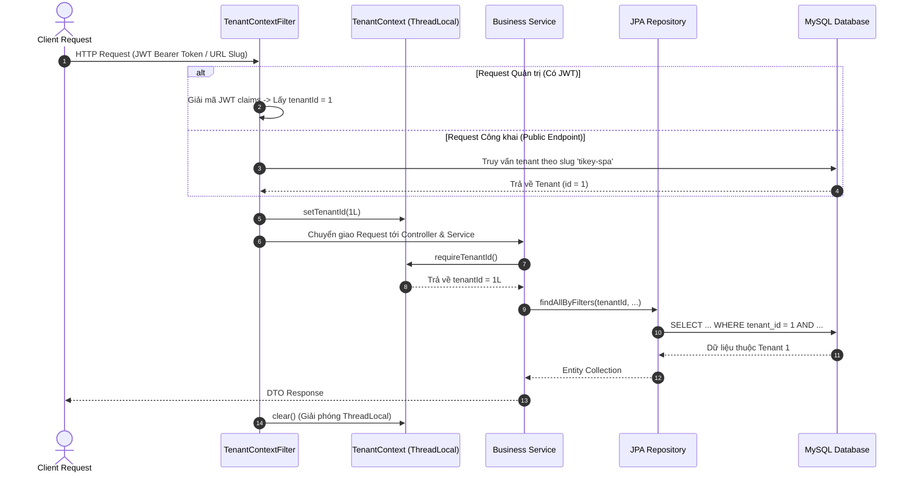

# Kiến trúc hệ thống TIKEY SPA (System Architecture)

Tài liệu này mô tả chi tiết kiến trúc phần mềm, nguyên lý phân tách tầng, mô hình luồng dữ liệu, cơ chế cô lập dữ liệu đa tenant (Multi-tenant Data Isolation) và các giải pháp kỹ thuật cốt lõi của nền tảng **TIKEY SPA**.

---

## 1. Tổng quan kiến trúc hệ thống

TIKEY SPA được thiết kế theo kiến trúc **Decoupled Client-Server (SPA & RESTful API)**, phân tách hoàn toàn giữa giao diện người dùng phía client và dịch vụ xử lý nghiệp vụ phía server:

- **Frontend Client (Single Page Application)**: Xây dựng trên nền tảng **React 19**, **TypeScript** và **Vite**, áp dụng định tuyến phía trình duyệt (**React Router DOM v7**) và styling tối ưu hóa bằng **Tailwind CSS v4**. Frontend giao tiếp với backend thông qua giao thức HTTPS và JSON REST API.
- **Backend API Server**: Xây dựng trên nền tảng **Spring Boot 4 (Java 17)**, kiến trúc phân tầng chuẩn mực (**Controller - Service - Repository**), quản lý bảo mật phi trạng thái bằng **Spring Security + JWT**, và truy xuất cơ sở dữ liệu qua **Spring Data JPA / Hibernate ORM**.
- **Cơ sở dữ liệu quan hệ (RDBMS)**: **MySQL 8+** (sử dụng engine **InnoDB**), toàn bộ cấu trúc bảng và chỉ mục được quản lý phiên bản tự động bằng **Flyway Migrations**.
- **Cổng thanh toán ngoại vi (Payment Gateway)**: Tích hợp cổng thanh toán **VNPay** (môi trường Sandbox) thông qua cơ chế URL Redirect, xử lý webhook bất đồng bộ **IPN (Instant Payment Notification)** và đối soát tự động **QueryDR**.

```mermaid
graph TD
    subgraph Client ["Client Layer (Trình duyệt người dùng)"]
        BrowserGuest["Khách hàng vãng lai\n(Public Booking & Tra cứu)"]
        BrowserAdmin["Chủ Spa (OWNER) & Nhân viên (STAFF)\n(Management Dashboard)"]
    end

    subgraph Edge ["Edge & CDN Layer (Phân phối & Định tuyến)"]
        CFPages["Cloudflare Pages\n- Static Assets Hosting\n- Immutable Edge Cache (/assets/*)\n- SPA HTML Fallback (public/_redirects)"]
        CFDns["Cloudflare DNS & Proxy\n- SSL Termination\n- Anti-DDoS & IP Forwarding (CF-Connecting-IP)"]
    end

    subgraph Backend ["Backend API Service (Spring Boot / Railway)"]
        SecurityFilter["Security Filter Chain\n- RateLimitFilter (In-Memory IP Limiter)\n- ClientIpResolver (Trusted Proxy / Anti-Spoof)\n- JwtAuthenticationFilter (Stateless RBAC)\n- TenantContextFilter (ThreadLocal Tenant Isolation)"]

        Controllers["REST Controllers\n- AuthController\n- PublicController\n- BookingController\n- StaffScheduleController\n- DashboardController\n- PaymentController & VNPay Webhook"]

        Services["Business Logic Services\n- BookingService & Concurrency Control\n- StaffScheduleService (Slot Calculation)\n- DashboardService (Metrics Aggregation)\n- PaymentService & RefundService"]

        Repositories["Data Access Layer\n- Spring Data JPA Repositories\n- Custom JPQL Queries with JOIN FETCH"]
    end

    subgraph Database ["Persistence Layer (Managed MySQL / Aiven)"]
        MySQL[("MySQL 8+ Database (InnoDB)\n- Managed by Flyway Migrations (V1 - V15)\n- UTF8MB4 Encoding\n- Composite B-Tree Indexes")]
    end

    subgraph External ["External Gateway (Cổng thanh toán)"]
        VNPay["VNPay Payment Gateway\n- Hosted Payment Page (VPC Pay)\n- Server-to-Server IPN Webhook\n- QueryDR Transaction Inquiry API"]
    end

    BrowserGuest -->|HTTPS / Static Assets| CFPages
    BrowserAdmin -->|HTTPS / Static Assets| CFPages
    BrowserGuest -->|HTTPS / API Requests| CFDns
    BrowserAdmin -->|HTTPS / API Requests| CFDns
    CFDns --> SecurityFilter
    SecurityFilter --> Controllers
    Controllers --> Services
    Services --> Repositories
    Repositories -->|JDBC / TLS (sslMode=REQUIRED)| MySQL

    Services -->|Redirect URL Generation| VNPay
    VNPay -->|Server-to-Server IPN| Controllers
    Services -->|Outbound QueryDR| VNPay
```

---

## 2. Phân tầng kiến trúc Backend (Layered Architecture)

Backend Spring Boot tuân thủ nguyên tắc phân tách trách nhiệm đơn lẻ (Single Responsibility Principle) và chia thành các tầng rõ rệt:

### 2.1. Tầng Filter & Security (Bảo mật & Ngữ cảnh)
1. **`RateLimitFilter`**: Kiểm soát tần suất yêu cầu trên từng địa chỉ IP máy khách. Áp dụng thuật toán Fixed Window bộ nhớ trong cho các endpoint nhạy cảm (`/api/v1/auth/login`, `/api/v1/public/**/feedback`, `/api/v1/refunds`).
2. **`ClientIpResolver`**: Giải mã địa chỉ IP thực của client thông qua các header proxy (`CF-Connecting-IP`, `X-Forwarded-For`), cơ chế chống giả mạo IP (Anti-Spoofing) bằng cách chỉ tin cậy kết nối đến từ các subnet mạng riêng nội bộ hoặc proxy được chỉ định trong `SECURITY_TRUSTED_PROXIES`.
3. **`JwtAuthenticationFilter`**: Đọc header `Authorization: Bearer <token>`, trích xuất thông tin người dùng và vai trò (`ROLE_OWNER`, `ROLE_STAFF`), nạp `CustomUserDetails` vào `SecurityContextHolder`.
4. **`PublicTenantContextFilter` & `TenantContextFilter`**:
   - Đối với API công khai: Trích xuất slug của spa từ đường dẫn URI (ví dụ `/api/v1/public/spas/tikey-spa/...`), truy vấn tenant đang hoạt động và nạp `tenant_id` vào `TenantContext`.
   - Đối với API quản trị: Trích xuất `tenant_id` đã được bảo mật từ JWT claims của người dùng đã đăng nhập và nạp vào `TenantContext`.

### 2.2. Tầng Controller (Điều phối REST API)
- Tiếp nhận HTTP requests, kiểm tra tính hợp lệ của tham số đầu vào bằng các annotation Bean Validation (`@Valid`, `@NotNull`, `@NotBlank`, `@Size`).
- Phân quyền cấp độ method bằng annotation `@PreAuthorize("hasRole('OWNER')")` hoặc `@PreAuthorize("hasAnyRole('OWNER', 'STAFF')")`.
- Không chứa nghiệp vụ xử lý dữ liệu; chuyển giao toàn bộ luồng xử lý xuống tầng Service và trả về `ResponseEntity<T>` với mã trạng thái HTTP chuẩn mực (200 OK, 201 CREATED, 400 BAD REQUEST, 403 FORBIDDEN, 404 NOT FOUND, 409 CONFLICT).

### 2.3. Tầng Service (Nghiệp vụ cốt lõi)
- Chịu trách nhiệm thực thi quy tắc nghiệp vụ, kiểm tra ràng buộc logic và tính toàn vẹn dữ liệu.
- Quản lý ranh giới giao dịch cơ sở dữ liệu bằng `@Transactional` (sử dụng `@Transactional(readOnly = true)` cho các thao tác đọc nhằm tối ưu hóa bộ đệm Hibernate).
- Kiểm soát tương tranh đặt lịch bằng cơ chế khóa bi quan (**Pessimistic Locking**: `LockModeType.PESSIMISTIC_WRITE`) trên các entity khách hàng và nhân viên khi tạo lịch hẹn.
- Tính toán khung giờ khả dụng (`getAvailableSlots`) bằng thuật toán nạp dữ liệu lịch đặt theo lô (Batch fetching) và duyệt mốc thời gian trên bộ nhớ RAM.

### 2.4. Tầng Repository & Entity (Truy xuất dữ liệu)
- Kế thừa `JpaRepository<T, ID>`, định nghĩa các truy vấn JPQL tùy biến.
- Triệt tiêu hoàn toàn vấn đề truy vấn thừa N+1 (N+1 Query Problem) thông qua chỉ định nạp tức thì tường minh (`LEFT JOIN FETCH` và `JOIN FETCH`).
- Toàn bộ thay đổi DDL của bảng được kiểm soát chặt chẽ bằng các script Flyway SQL (`V1` đến `V15`), cấu hình JPA `ddl-auto=validate` ngăn chặn việc Hibernate tự ý thay đổi cấu trúc bảng khi khởi động.

---

## 3. Cơ chế cô lập dữ liệu đa Tenant (Tenant Data Isolation)

Dù hiện tại hệ thống tập trung triển khai cho thương hiệu TIKEY SPA, cấu trúc dữ liệu và logic backend đã được thiết kế sẵn theo mô hình **Logical Shared Database, Shared Schema Multi-Tenancy**:



### Nguyên lý thực thi
1. **ThreadLocal Encapsulation**: Lớp `TenantContext` lưu trữ `tenant_id` của thread đang xử lý yêu cầu hiện tại.
2. **Bắt buộc ngữ cảnh (Enforcement)**: Mọi thao tác ghi hoặc đọc dữ liệu trong các Service đều gọi hàm `TenantContext.requireTenantId()`. Nếu thread không có `tenant_id`, hệ thống sẽ lập tức ném ra ngoại lệ `IllegalStateException` và ngắt giao dịch.
3. **Mệnh đề WHERE bắt buộc**: Mọi truy vấn JPA Repository đều gắn điều kiện lọc `b.tenant.id = :tenantId`. Không tồn tại bất kỳ truy vấn quản trị nào quét toàn bộ bảng mà bỏ qua `tenant_id`.
4. **Giải phóng an toàn (Cleanup)**: Khối `finally` trong `TenantContextFilter` luôn thực thi `TenantContext.clear()` để ngăn ngừa hiện tượng rò rỉ ngữ cảnh sang các luồng khác trong Thread Pool của Tomcat.

---

## 4. Tối ưu hóa hiệu năng Full-Stack (Performance Architecture)

Hệ thống đã trải qua quá trình đánh giá và tối ưu hóa hiệu năng toàn diện trên cả 2 đầu Frontend và Backend:

### 4.1. Tối ưu hóa Frontend (Client-side)
- **Tách gói theo route (Route-level Code Splitting)**: Sử dụng `React.lazy()` và `<Suspense>` trong `App.tsx` cho toàn bộ 11 trang quản trị và trang kết quả. Trình duyệt của khách vãng lai chỉ tải mã nguồn của trang chủ đặt lịch, giảm kích thước gói JavaScript ban đầu từ **680.70 kB** xuống **337.55 kB** (**giảm 50.4% dung lượng mạng**; gzip 93.90 kB).
- **Bộ nhớ đệm biên Cloudflare (Immutable Asset Caching)**: File `_headers` cấu hình quy tắc cache HTTP:
  - `/assets/*`: Gán `Cache-Control: public, max-age=31536000, immutable` cho các file tĩnh đã được gắn mã băm nội dung (content-hashed).
  - `/*`: Gán `Cache-Control: public, max-age=0, must-revalidate` cho file HTML và robots.txt để đảm bảo người dùng luôn nhận bản cập nhật mới nhất ngay khi triển khai.
- **Sửa lỗi Robots.txt**: Bổ sung `robots.txt` chuẩn, giải quyết triệt để lỗi Cloudflare SPA chuyển hướng phục vụ file HTML khi bot tìm kiếm thu thập thông tin.

### 4.2. Tối ưu hóa Backend (Server-side)
- **Thuật toán kiểm tra lịch trống theo lô (Batch Availability Calculation)**:
  - *Trước tối ưu*: Vòng lặp duyệt từng khung giờ 30 phút $\times$ từng nhân viên kích hoạt 4 câu truy vấn SQL lặp lại (`findById`, `existsDayOff`, `findByWorkingHours`, `countOverlappingStaffBookings`), tiêu tốn tới **360 truy vấn cơ sở dữ liệu** cho 1 yêu cầu kiểm tra lịch trống.
  - *Sau tối ưu*: Service nạp toàn bộ các lịch đặt gây xung đột của các nhân viên đang làm việc trong ngày qua duy nhất 1 câu truy vấn lô `findBlockingBookingsForStaff`, sau đó tính toán va chạm thời gian trên bộ nhớ RAM. Số lượng truy vấn giảm xuống còn **3 - 4 truy vấn** (**giảm hơn 98% số round-trip database**).
- **Triệt tiêu N+1 Query**:
  - Thêm `LEFT JOIN FETCH s.category` trong `ServiceRepository` khi tải danh sách dịch vụ.
  - Thêm `JOIN FETCH b.customer JOIN FETCH b.service LEFT JOIN FETCH b.staff` trong `BookingRepository.findDailySchedule` khi xem lịch làm việc hàng ngày.
- **Tái sử dụng nhóm trạng thái Dashboard**: Tái sử dụng kết quả từ hàm `countBookingsByStatus` để trích xuất số lượng booking `PENDING` và `CONFIRMED`, cắt giảm 2 truy vấn đếm riêng lẻ mỗi lần tải trang tổng quan.
- **Bổ sung chỉ mục tổng hợp (Composite Indexes - Migration V15)**: Bổ sung chỉ mục `idx_bookings_tenant_staff_status_times` và `idx_bookings_tenant_customer_status_times` nhằm tăng tốc tối đa tốc độ quét phạm vi thời gian khi kiểm tra trùng lịch.

---

## 5. Ranh giới trách nhiệm hệ thống (Separation of Concerns)

| Thành phần | Trách nhiệm | Không chịu trách nhiệm |
| :--- | :--- | :--- |
| **Frontend (React)** | - Hiển thị giao diện người dùng và phản hồi tương tác.<br>- Xác thực định dạng form phía client (UX).<br>- Lưu trữ và đính kèm JWT vào header yêu cầu.<br>- Điều hướng trang SPA không cần tải lại trình duyệt. | - Không quyết định quyền truy cập dữ liệu.<br>- Không tính toán giá tiền cuối cùng hoặc trạng thái thanh toán.<br>- Không thực hiện nghiệp vụ xử lý lịch đặt. |
| **Backend API (Spring Boot)** | - Xác thực danh tính và phân quyền người dùng (RBAC).<br>- Cô lập dữ liệu theo Tenant.<br>- Kiểm soát khóa tương tranh đặt lịch.<br>- Xác thực chữ ký số HMAC-SHA512 của cổng VNPay.<br>- Ghi nhật ký nghiệp vụ và bảo vệ dữ liệu. | - Không lưu trữ session trạng thái người dùng (Stateless).<br>- Không render HTML phía máy chủ.<br>- Không lưu trữ mật khẩu ở dạng rõ (Plaintext). |
| **Database (MySQL)** | - Lưu trữ dữ liệu quan hệ có cấu trúc.<br>- Đảm bảo tính toàn vẹn khóa ngoại và ràng buộc duy nhất.<br>- Hỗ trợ khóa bi quan (Row-level locking) cho giao dịch. | - Không chứa logic nghiệp vụ phức tạp (không dùng Stored Procedures).<br>- Không tự sinh schema ngoài tầm kiểm soát của Flyway. |
| **Cloudflare / Edge** | - Quản lý DNS và cấp phát chứng chỉ HTTPS.<br>- Phân phối bộ nhớ đệm CDN cho file tĩnh.<br>- Ngăn chặn tấn công từ chối dịch vụ (DDoS) và chuyển tiếp IP khách hàng. | - Không can thiệp vào logic xác thực JWT của backend API. |

---

Tài liệu liên quan:
- [Thiết kế Cơ sở dữ liệu (docs/DATABASE.md)](DATABASE.md)
- [Danh mục API RESTful (docs/API.md)](API.md)
- [Bảo mật & Phân quyền (docs/SECURITY.md)](SECURITY.md)
- [Hướng dẫn Triển khai Production (docs/DEPLOYMENT.md)](DEPLOYMENT.md)
