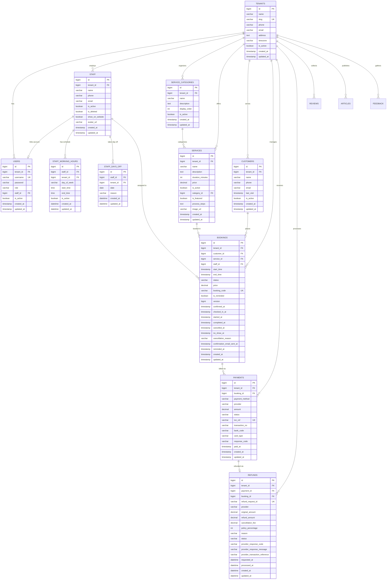
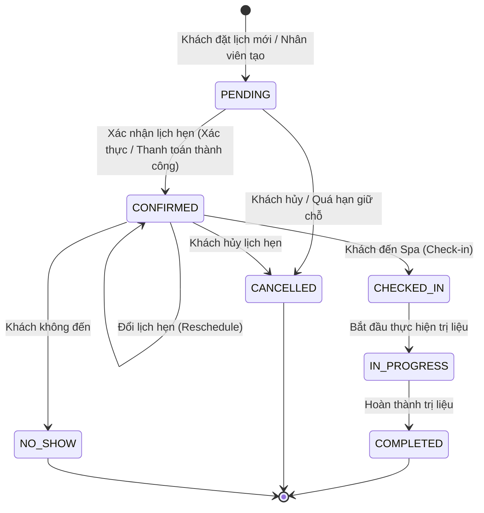
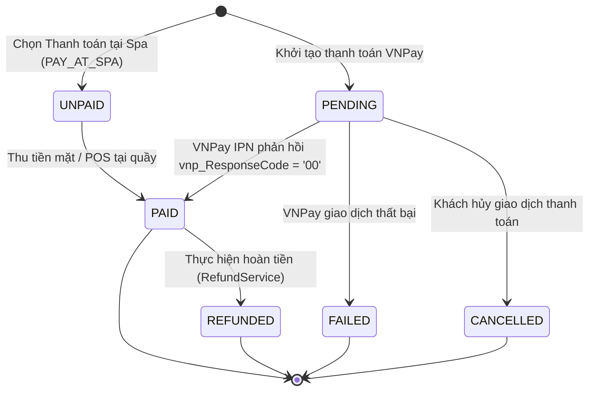

# Thiết kế Cơ sở Dữ liệu TIKEY SPA (Database Design & Schemas)

Tài liệu này cung cấp chi tiết thiết kế cơ sở dữ liệu quan hệ của hệ thống **TIKEY SPA**, bao gồm cấu trúc các bảng, quan hệ khóa ngoại (ERD), hệ thống chỉ mục (Index), vòng đời chuyển đổi trạng thái và quy trình quản lý schema bằng **Flyway**.

---

## 1. Thông số kỹ thuật chung

- **Hệ quản trị CSDL (RDBMS)**: MySQL 8.0+
- **Động cơ lưu trữ (Storage Engine)**: `InnoDB` (hỗ trợ ACID transactions, Row-level locking và Foreign Key constraints).
- **Bảng mã ký tự (Character Set & Collation)**: `utf8mb4` / `utf8mb4_unicode_ci` (hỗ trợ trọn vẹn tiếng Việt có dấu, ký tự đặc biệt và emoji).
- **Chiến lược Schema Management**: Kiểm soát phiên bản tập trung 100% bằng **Flyway Migration**. Chế độ JPA Hibernate luôn đặt ở `spring.jpa.hibernate.ddl-auto=validate` để ngăn chặn tự động thay đổi cấu trúc bảng ngoài ý muốn.

---

## 2. Sơ đồ Thực thể - Mối quan hệ (Entity Relationship Diagram - ERD)

---

## 3. Danh mục bảng dữ liệu chi tiết

### 3.1. Bảng `tenants` (Spa / Cơ sở kinh doanh)
Lưu trữ thông tin cơ sở spa. Hiện tại hệ thống có 1 tenant hoạt động mặc định (`slug = 'tikey-spa'`), nhưng kiến trúc sẵn sàng mở rộng đa tenant.
- `id`: Khóa chính (Auto Increment).
- `name`: Tên thương hiệu spa (ví dụ "TIKEY SPA").
- `slug`: Mã định danh URL duy nhất (Unique Index), dùng trong các API công khai (`/api/v1/public/spas/{slug}`).
- `timezone`: Múi giờ hoạt động mặc định (`Asia/Ho_Chi_Minh`).
- `is_active`: Trạng thái hoạt động của cơ sở.

### 3.2. Bảng `staff` (Nhân viên trị liệu)
- `tenant_id`: Khóa ngoại tham chiếu `tenants(id)`.
- `name`, `phone`, `email`: Thông tin liên hệ của nhân viên.
- `is_active`: Trạng thái sẵn sàng nhận lịch đặt.
- `is_deleted`: Cờ xóa mềm (Soft delete) bảo toàn lịch sử đặt lịch quá khứ.
- `show_on_website`: Cho phép hiển thị hình ảnh và hồ sơ nhân viên trên website công khai.
- `avatar_url`: Đường dẫn ảnh đại diện của nhân viên.

### 3.3. Bảng `users` (Tài khoản người dùng nội bộ)
- `tenant_id`: Khóa ngoại tham chiếu `tenants(id)`.
- `username`: Tên đăng nhập duy nhất (Unique Index).
- `password`: Mật khẩu được mã hóa an toàn bằng thuật toán **BCrypt**.
- `role`: Vai trò người dùng (`ROLE_OWNER` hoặc `ROLE_STAFF`).
- `staff_id`: Khóa ngoại tham chiếu `staff(id)` (NULL đối với tài khoản OWNER). Liên kết 1-1 với hồ sơ nhân viên để thực thi kiểm soát dữ liệu cá nhân.

### 3.4. Bảng `staff_working_hours` & `staff_days_off` (Lịch làm việc & Ngày nghỉ)
- `staff_working_hours`: Khung giờ làm việc theo ngày trong tuần (`day_of_week`: `MONDAY` đến `SUNDAY`, `start_time`, `end_time`, `is_active`). Ràng buộc duy nhất `uk_staff_day_of_week(tenant_id, staff_id, day_of_week)`.
- `staff_days_off`: Ngày nghỉ đột xuất hoặc định kỳ của nhân viên (`date`, `reason`). Ràng buộc duy nhất `uk_staff_date(tenant_id, staff_id, date)`.

### 3.5. Bảng `service_categories` & `services` (Danh mục & Dịch vụ)
- `service_categories`: Nhóm phân loại dịch vụ spa (`name`, `display_order`, `is_active`).
- `services`: Thông tin dịch vụ trị liệu:
  - `duration_minutes`: Thời lượng dịch vụ tính bằng phút (sử dụng để tự động tính thời điểm kết thúc lịch hẹn `end_time = start_time + duration_minutes`).
  - `price`: Đơn giá niêm yết (Decimal 10, 2).
  - `is_featured`: Đánh dấu dịch vụ nổi bật hiển thị ở trang chủ.
  - `process_steps`: Mô tả quy trình các bước trị liệu (dạng chuỗi văn bản).
  - `image_url`: Ảnh đại diện dịch vụ.

### 3.6. Bảng `customers` (Hồ sơ khách hàng)
- Lưu trữ thông tin khách hàng được hệ thống tự động nhận diện hoặc tạo mới dựa trên số điện thoại (`phone`) trong phạm vi từng tenant.
- `last_visit`: Thời điểm hoàn thành lịch hẹn gần nhất.

### 3.7. Bảng `bookings` (Lịch đặt dịch vụ)
Bảng trung tâm của toàn bộ hệ thống, lưu trữ chi tiết lịch hẹn:
- `booking_code`: Mã tra cứu lịch hẹn duy nhất (64 ký tự, ví dụ `BK-ABC123XYZ`), dùng để tra cứu công khai không cần đăng nhập.
- `version`: Khóa kiểm soát tương tranh lạc quan (**Optimistic Locking** `@Version`) chống cập nhật đè.
- `status`: Trạng thái vòng đời của lịch hẹn (`BookingStatus`).
- `price`: Giá tiền chụp lại (Snapshot price) tại thời điểm đặt lịch, bảo toàn doanh thu lịch sử ngay cả khi giá dịch vụ thay đổi.
- Các mốc thời gian kiểm toán: `confirmed_at`, `checked_in_at`, `started_at`, `completed_at`, `cancelled_at`, `no_show_at`.
- `confirmation_email_sent_at`, `reminded_at`: Kiểm soát gửi email thông báo và nhắc lịch tự động.

### 3.8. Bảng `payments` & `refunds` (Giao dịch thanh toán & Hoàn tiền)
- `payments`: Ghi nhận giao dịch thanh toán:
  - `payment_method`: Phương thức thanh toán (`PAY_AT_SPA`, `VNPAY`).
  - `status`: Trạng thái thanh toán (`PaymentStatus`).
  - `txn_ref`: Mã tham chiếu giao dịch gửi sang VNPay (Duy nhất).
  - `transaction_no`: Mã giao dịch do cổng VNPay phản hồi.
- `refunds`: Ghi nhận yêu cầu hoàn tiền khi hủy lịch hẹn trả trước:
  - `original_amount`: Số tiền gốc đã thanh toán.
  - `refund_amount`: Số tiền hoàn trả thực tế sau khi khấu trừ phí hủy lịch.
  - `cancellation_fee`: Phí hủy lịch áp dụng theo chính sách thời gian.
  - `status`: Trạng thái hoàn tiền (`PENDING`, `COMPLETED`, `FAILED`).

### 3.9. Bảng nội dung bổ trợ: `reviews`, `articles`, `feedback`
- `reviews`: Đánh giá của khách hàng (`rating`, `comment`, `is_published`, `display_order`).
- `articles`: Bài viết cẩm nang làm đẹp (`title`, `slug`, `content`, `status`: `DRAFT` / `PUBLISHED`).
- `feedback`: Ý kiến đóng góp từ khách hàng gửi qua form website công khai.

---

## 4. Vòng đời Trạng thái Booking & Payment

Hệ thống quản lý độc lập nhưng liên kết chặt chẽ giữa trạng thái lịch hẹn (`BookingStatus`) và trạng thái giao dịch (`PaymentStatus`):

### 4.1. Vòng đời Trạng thái Lịch hẹn (BookingStatus)

### 4.2. Vòng đời Trạng thái Thanh toán (PaymentStatus)

**Quy tắc bất biến (Invariants)**:
1. Giao dịch đã đạt trạng thái cuối cùng `PAID` **không bao giờ bị hạ cấp** về `FAILED` hoặc `CANCELLED` trong các lần gọi lặp lại của webhook VNPay IPN.
2. Lịch hẹn ở trạng thái `COMPLETED` hoặc `CANCELLED` không được phép đổi lịch (`Reschedule`).
3. Giá tiền trên booking (`price`) là giá snapshot tại thời điểm đặt; không tự ý tính lại khi cập nhật thông tin lịch hẹn.

---

## 5. Lịch sử Migration Flyway (Database Migrations)

| Phiên bản | Tên file Migration | Nội dung chính |
| :--- | :--- | :--- |
| **V1** | `V1__init_schema.sql` | Khởi tạo cấu trúc bảng nền tảng: `tenants`, `staff`, `users`, `services`, `customers`, `bookings`. |
| **V2** | `V2__add_customer_is_active.sql` | Thêm cột `is_active` vào bảng `customers`. |
| **V3** | `V3__add_booking_price.sql` | Thêm cột `price` vào `bookings`, thêm chỉ mục `idx_bookings_tenant_staff`, `idx_bookings_tenant_customer`, `idx_bookings_tenant_start_time`. |
| **V4** | `V4__add_booking_code.sql` | Thêm cột `booking_code` (Unique Index) cho tra cứu công khai. |
| **V5** | `V5__add_staff_avatar_and_service_image.sql` | Thêm cột `avatar_url` cho `staff` và `image_url` cho `services`. |
| **V6** | `V6__create_feedback_table.sql` | Tạo bảng `feedback` tiếp nhận ý kiến đóng góp. |
| **V7** | `V7__rename_demo_spa_tenant.sql` | Cập nhật tên và slug tenant mẫu sang `TIKEY SPA` (`tikey-spa`). |
| **V8** | `V8__add_staff_is_deleted.sql` | Thêm cờ xóa mềm `is_deleted` cho bảng `staff`. |
| **V9** | `V9__phase_b5_content_and_service_enhancements.sql` | Thêm bảng `service_categories`, `reviews`, `articles`; mở rộng `services` (`category_id`, `is_featured`, `process_steps`). |
| **V10** | `V10__phase_b6_payments.sql` | Tạo bảng `payments` quản lý lịch sử thanh toán VNPay và Pay at Spa. |
| **V11** | `V11__phase_b7_booking_operations.sql` | Bổ sung các cột kiểm toán vòng đời lịch hẹn: `confirmed_at`, `checked_in_at`, `started_at`, `completed_at`, `cancelled_at`, `no_show_at`, `cancellation_reason`. |
| **V12** | `V12__phase_b8_staff_scheduling.sql` | Tạo bảng `staff_working_hours` và `staff_days_off` quản lý ca làm và ngày nghỉ. |
| **V13** | `V13__phase_b8_1_payment_refund.sql` | Tạo bảng `refunds` phục vụ nghiệp vụ hoàn tiền và chính sách hủy lịch. |
| **V14** | `V14__phase_1_3_booking_email_notifications.sql` | Bổ sung cột kiểm soát gửi email `confirmation_email_sent_at`, `reminded_at`, thêm chỉ mục `idx_bookings_reminder_lookup`. |
| **V15** | `V15__add_booking_performance_indexes.sql` | Bổ sung 3 chỉ mục composite tối ưu hiệu năng: `idx_bookings_tenant_status`, `idx_bookings_tenant_staff_status_times`, `idx_bookings_tenant_customer_status_times`. |

---

## 6. Hệ thống Chỉ mục Tối ưu Hiệu năng (Indexes)

Hệ thống sở hữu các chỉ mục được thiết kế dựa trên tần suất truy vấn thực tế:

1. **`uq_bookings_booking_code`** on `bookings(booking_code)`: Đảm bảo tính duy nhất và tra cứu lịch hẹn với độ phức tạp $O(1)$.
2. **`idx_bookings_tenant_status`** on `bookings(tenant_id, status)`: Tối ưu hóa truy vấn lọc lịch hẹn theo trạng thái và câu lệnh `GROUP BY b.status` của Dashboard.
3. **`idx_bookings_tenant_staff_status_times`** on `bookings(tenant_id, staff_id, status, start_time, end_time)`: Chỉ mục composite bao phủ (Covering Index) cho các câu truy vấn kiểm tra trùng lịch nhân viên (`countOverlappingStaffBookings`) và nạp lịch chặn theo lô (`findBlockingBookingsForStaff`).
4. **`idx_bookings_tenant_customer_status_times`** on `bookings(tenant_id, customer_id, status, start_time, end_time)`: Kiểm tra khách hàng có bị đặt trùng giờ giữa các dịch vụ khác nhau hay không.
5. **`idx_payments_txn_ref`** on `payments(txn_ref)`: Phục vụ đối soát tức thì cho webhook VNPay IPN.
6. **`idx_swh_staff_tenant`** on `staff_working_hours(tenant_id, staff_id)`: Nạp cấu hình ca làm việc của nhân viên trong ngày.

---

Tài liệu liên quan:
- [Kiến trúc hệ thống (docs/ARCHITECTURE.md)](ARCHITECTURE.md)
- [Danh mục API (docs/API.md)](API.md)
- [Hướng dẫn Phát triển Local (docs/DEVELOPMENT.md)](DEVELOPMENT.md)
