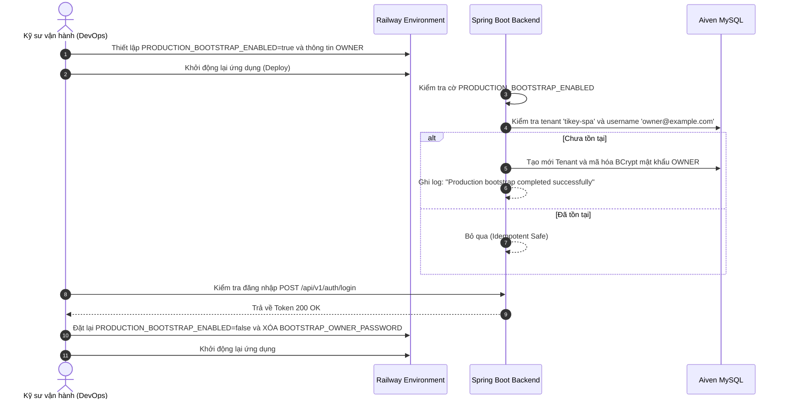

# Hướng dẫn Triển khai Production (Production Deployment Guide)

Tài liệu này cung cấp hướng dẫn triển khai thực tế trên môi trường Production cho hệ thống **TIKEY SPA** theo mô hình kiến trúc đám mây phân tán: **Cloudflare Pages (Frontend)** + **Railway (Backend API)** + **Aiven MySQL (Managed Database over TLS)**.

---

## 1. Mô hình Kiến trúc Triển khai (Production Topology)

Môi trường Production phân tách độc lập giữa việc phân phối tài nguyên tĩnh, thực thi container ứng dụng và cơ sở dữ liệu quan hệ được quản lý:

```mermaid
flowchart TD
    subgraph Users ["Người dùng Internet"]
        Client["Trình duyệt Web (Desktop / Mobile)"]
    end

    subgraph CloudflareEdge ["Cloudflare Edge & DNS"]
        CFDNS["Cloudflare DNS & WAF\n- HTTPS Termination\n- DDoS Protection\n- Header Forwarding: CF-Connecting-IP"]
    end

    subgraph StaticFrontend ["Cloudflare Pages (Static SPA)"]
        Pages["Cloudflare Pages\n- Domain: example.com & www.example.com\n- Build: React 19 / Vite dist/\n- Routing: public/_redirects (SPA Fallback)\n- Edge Cache: public/_headers (immutable)"]
    end

    subgraph BackendRailway ["Railway (Containerized API)"]
        RailwayAPI["Spring Boot API Service\n- Custom Domain: api.example.com\n- Profile: SPRING_PROFILES_ACTIVE=prod\n- Connection Pool: HikariCP (Max 10)\n- Graceful Shutdown: 20s Timeout"]
    end

    subgraph DatabaseAiven ["Aiven (Managed Relational DB)"]
        AivenDB[("Aiven Managed MySQL 8+\n- Enforced TLS: sslMode=REQUIRED\n- Automated Backups & HA\n- Port: Managed Port (Tách biệt Internet)")]
    end

    subgraph VNPayGW ["Cổng thanh toán"]
        VNPay["VNPay Sandbox / Live Gateway"]
    end

    Client -->|HTTPS| CFDNS
    CFDNS -->|Gốc: example.com| Pages
    CFDNS -->|Subdomain: api.example.com (CNAME)| RailwayAPI
    RailwayAPI -->|TLS Encrypted JDBC| AivenDB
    Client -.->|Thanh toán Redirect| VNPay
    VNPay -->|Server-to-Server IPN Webhook| RailwayAPI
```

### Bảng phân công trách nhiệm dịch vụ

| Thành phần | Nhà cung cấp | Trách nhiệm và Phạm vi |
| :--- | :--- | :--- |
| **Edge & DNS** | **Cloudflare** | Quản lý bản ghi DNS có thẩm quyền, cấp phát chứng chỉ HTTPS, chống tấn công DDoS, phân phối bộ nhớ đệm biên CDN và chuyển tiếp IP thực của người dùng (`CF-Connecting-IP`). |
| **Frontend Static** | **Cloudflare Pages** | Lưu trữ phân phối các file build tĩnh của React/Vite (`dist/`), định tuyến SPA qua `_redirects` và cấu hình bộ nhớ đệm HTTP qua `_headers`. |
| **Backend API** | **Railway** | Khởi chạy container Spring Boot, quản lý tên miền phụ tùy chỉnh (`api.example.com`), tự động gia hạn chứng chỉ Let's Encrypt TLS và tiêm các biến môi trường bảo mật. |
| **Database** | **Aiven** | Dịch vụ CSDL MySQL được quản lý, cơ chế sao lưu tự động hàng ngày, bắt buộc mã hóa đường truyền qua giao thức TLS (`sslMode=REQUIRED`). |

---

## 2. Cấu hình Tên miền và Bản ghi DNS (DNS Setup)

*Lưu ý: Thay thế `example.com` bằng tên miền thật đã sở hữu khi cấu hình thực tế.*

1. **Frontend (Cloudflare Pages)**:
   - Trong giao diện Cloudflare Pages: Đi tới **Custom Domains** $\rightarrow$ Thêm `example.com` và `www.example.com`.
   - Cloudflare sẽ tự động định tuyến lưu lượng truy cập từ tên miền chính vào ứng dụng Pages mà không cần cấu hình thêm bản ghi CNAME thủ công.
2. **Backend API (Railway)**:
   - Trong bảng điều khiển Railway: Đi tới **Settings** $\rightarrow$ **Networking** $\rightarrow$ **Custom Domain** $\rightarrow$ Thêm `api.example.com`.
   - Railway sẽ cung cấp một bản ghi DNS đích dạng `xxxxx.up.railway.app` và một bản ghi TXT để xác thực quyền sở hữu tên miền.
   - Trong bảng quản lý **Cloudflare DNS**:
     - Thêm bản ghi `CNAME`: Tên `api`, Đích đến: giá trị Railway cung cấp (bật trạng thái Proxy - đám mây màu cam).
     - Thêm bản ghi `TXT`: Xác thực tên miền theo hướng dẫn của Railway.
3. **Chế độ mã hóa SSL/TLS trên Cloudflare**:
   - Truy cập **SSL/TLS** trên Cloudflare dashboard $\rightarrow$ Chuyển chế độ sang **Full** (hoặc **Full (Strict)**).
   - **CẢNH BÁO NGUY HIỂM: TUYỆT ĐỐI KHÔNG CHỌN Flexible SSL**. Chế độ Flexible sẽ gửi yêu cầu dạng HTTP không mã hóa tới Railway, làm vô hiệu hóa thuộc tính Secure của cookie, gây lỗi HSTS và tạo nguy cơ lộ lọt dữ liệu.

---

## 3. Triển khai Frontend trên Cloudflare Pages

### 3.1. Cấu hình bản dựng (Build Settings)
- **Framework Preset**: `Vite`
- **Build Command**: `npm run build`
- **Build Output Directory**: `dist`
- **Root Directory**: `frontend`
- **Biến môi trường Build**:
  - `VITE_API_BASE_URL`: `https://api.example.com/api/v1`

### 3.2. Xác minh các file cấu hình tại thư mục `frontend/public/`
- **`frontend/public/_redirects`**: Đảm bảo chứa quy tắc rewrite SPA:
  ```text
  /* /index.html 200
  ```
- **`frontend/public/_headers`**: Đảm bảo chứa chính sách bộ nhớ đệm biên:
  ```text
  /assets/*
    Cache-Control: public, max-age=31536000, immutable

  /*
    Cache-Control: public, max-age=0, must-revalidate
  ```
- **`frontend/public/robots.txt`**: Cấu hình tệp robots chuẩn nhằm ngăn Cloudflare SPA rewrite trả về HTML cho bot tìm kiếm.

---

## 4. Triển khai Backend trên Railway

### 4.1. Thiết lập Profile và Lệnh khởi chạy
- **Build Command**: Tự động nhận diện `Dockerfile` tại thư mục `backend/Dockerfile` hoặc chạy Maven:
  ```bash
  ./mvnw clean package -DskipTests
  ```
- **Start Command**:
  ```bash
  java -Dspring.profiles.active=prod -jar target/spabooking-0.0.1-SNAPSHOT.jar
  ```
- Cấu hình Graceful Shutdown trong `application-prod.properties` đã được bật sẵn (`server.shutdown=graceful`, thời gian chờ 20 giây), đảm bảo các request đang thực thi không bị ngắt quãng khi Railway triển khai phiên bản mới.

---

## 5. Bảng Biến Môi trường Production Đầy đủ

Toàn bộ các biến môi trường bên dưới phải được thiết lập trực tiếp trong mục **Variables** trên bảng điều khiển của Railway. Không bao giờ commit các giá trị này vào file `.env` trên Git:

| Tên biến môi trường | Bắt buộc | Định dạng / Ví dụ an toàn | Mục đích và Hành vi |
| :--- | :--- | :--- | :--- |
| `SPRING_PROFILES_ACTIVE` | Có | `prod` | Kích hoạt cấu hình `application-prod.properties`, tắt SQL log và tắt dữ liệu mẫu DevDataSeeder. |
| `SPRING_DATASOURCE_URL` | Có | `jdbc:mysql://YOUR_AIVEN_HOST:PORT/defaultdb?useUnicode=true&characterEncoding=utf-8&sslMode=REQUIRED&serverTimezone=Asia/Ho_Chi_Minh` | Đường dẫn kết nối JDBC an toàn tới Aiven MySQL. Bắt buộc có tham số `sslMode=REQUIRED`. |
| `SPRING_DATASOURCE_USERNAME`| Có | `avnadmin` | Tên tài khoản quản trị cơ sở dữ liệu do Aiven cấp. |
| `DB_PASSWORD` | Có | *(Mật khẩu phức tạp)* | Mật khẩu truy cập cơ sở dữ liệu Aiven MySQL. |
| `JWT_SECRET` | Có | *(Chuỗi ngẫu nhiên tối thiểu 32 ký tự / 256 bits)* | Khóa bí mật dùng để ký và giải mã JWT token. |
| `JWT_EXPIRATION_MS` | Không | `86400000` (24 giờ) | Thời gian sống của JWT token tính bằng mili-giây. |
| `CORS_ALLOWED_ORIGINS` | Có | `https://example.com,https://www.example.com` | Danh sách tên miền được phép gọi API. Tuyệt đối không dùng ký tự đại diện `*` khi cho phép credentials. |
| `SERVER_FORWARD_HEADERS_STRATEGY`| Không | `framework` | Kích hoạt `ForwardedHeaderFilter` để Spring nhận biết chính xác giao thức HTTPS và IP từ proxy biên. |
| `SECURITY_TRUSTED_PROXIES` | Không | `127.0.0.1,::1,10.0.0.0/8,172.16.0.0/12,192.168.0.0/16` | Dải mạng proxy đáng tin cậy phục vụ cơ chế chống giả mạo header IP (`CF-Connecting-IP`). |
| `VNPAY_TMN_CODE` | Có | `VMWY8Z1F` (Sandbox) hoặc Mã Live | Mã định danh Merchant do VNPay cung cấp. |
| `VNPAY_HASH_SECRET` | Có | *(Mã bí mật do VNPay cung cấp)* | Khóa bí mật dùng để tạo và xác thực chữ ký số HMAC-SHA512. |
| `VNPAY_PAYMENT_URL` | Có | `https://sandbox.vnpayment.vn/paymentv2/vpcpay.html` | Cổng chuyển hướng thanh toán của VNPay. |
| `VNPAY_RETURN_URL` | Có | `https://example.com/dat-lich/callback` | Đường dẫn trình duyệt quay trở về sau khi khách thanh toán xong trên VNPay. |
| `VNPAY_IPN_URL` | Không | `https://api.example.com/api/v1/payments/vnpay-ipn` | Đường dẫn Webhook IPN nhận kết quả bất đồng bộ từ máy chủ VNPay. |
| `VNPAY_REFUND_URL` | Không | `https://sandbox.vnpayment.vn/merchant_webapi/api/transaction` | Cổng API gửi yêu cầu hoàn tiền tự động sang VNPay. |
| `VNPAY_QUERYDR_URL` | Không | `https://sandbox.vnpayment.vn/merchant_webapi/api/transaction` | Cổng API đối soát tình trạng giao dịch QueryDR. |

---

## 6. Quy trình Khởi tạo Tài khoản OWNER Đầu tiên (Bootstrap Procedure)

Trong môi trường Production, `DevDataSeeder` hoàn toàn bị vô hiệu hóa để bảo đảm tính an toàn. Hệ thống cung cấp cơ chế khởi tạo tenant và tài khoản quản trị đầu tiên thông qua `ProductionOwnerBootstrapSeeder`:



### Các bước thực hiện chi tiết:
1. **Thiết lập biến môi trường Bootstrap trên Railway**:
   ```env
   PRODUCTION_BOOTSTRAP_ENABLED=true
   BOOTSTRAP_TENANT_NAME=TIKEY SPA
   BOOTSTRAP_TENANT_SLUG=tikey-spa
   BOOTSTRAP_TENANT_PHONE=0901234567
   BOOTSTRAP_TENANT_EMAIL=contact@tikeyspa.com
   BOOTSTRAP_TENANT_ADDRESS=123 Đường Nguyễn Huệ, Quận 1, TP. Hồ Chí Minh
   BOOTSTRAP_TENANT_TIMEZONE=Asia/Ho_Chi_Minh
   BOOTSTRAP_OWNER_USERNAME=owner@tikeyspa.com
   BOOTSTRAP_OWNER_PASSWORD=MatKhauBaoMatCucManh987!
   ```
2. **Khởi động ứng dụng**: Lưu cấu hình và chờ Railway triển khai. Kiểm tra log của ứng dụng để xác nhận dòng thông báo:
   ```text
   Production bootstrap process finished. Tenant and initial owner account verified.
   ```
3. **Kiểm tra đăng nhập**: Sử dụng Postman hoặc Curl gửi yêu cầu đăng nhập:
   ```bash
   curl -X POST https://api.example.com/api/v1/auth/login \
     -H "Content-Type: application/json" \
     -d '{"username":"owner@tikeyspa.com","password":"MatKhauBaoMatCucManh987!"}'
   ```
4. **VÔ HIỆU HÓA BOOTSTRAP NGAY LẬP TỨC**:
   - Chuyển `PRODUCTION_BOOTSTRAP_ENABLED=false` (hoặc xóa hẳn biến này).
   - Xóa bỏ biến `BOOTSTRAP_OWNER_PASSWORD` khỏi cấu hình Railway.
   - Lưu cấu hình để ứng dụng triển khai lại mà không còn lưu giữ mật khẩu khởi tạo trong biến môi trường.

---

## 7. Kiểm tra Tình trạng Hoạt động (Health Checks & Monitoring)

Spring Boot Actuator đã được cấu hình chế độ bảo mật tối đa cho Production:
- **Kiểm tra sức khỏe tổng thể**:
  ```bash
  curl -I https://api.example.com/actuator/health
  ```
  Phản hồi chuẩn: `HTTP/1.1 200 OK` với thân nội dung `{"status":"UP"}`.
- **Tính năng bảo mật Actuator**:
  - `management.endpoint.health.show-details=never`: Không để lộ thông tin phiên bản cơ sở dữ liệu, dung lượng ổ đĩa hay stack trace ra ngoài.
  - Các endpoint nhạy cảm (`/actuator/env`, `/actuator/beans`, `/actuator/heapdump`) đã bị tắt hoàn toàn khỏi giao diện Web.

---

Tài liệu liên quan:
- [Kiến trúc hệ thống (docs/ARCHITECTURE.md)](ARCHITECTURE.md)
- [Bảo mật & Phân quyền (docs/SECURITY.md)](SECURITY.md)
- [Hướng dẫn Phát triển Local (docs/DEVELOPMENT.md)](DEVELOPMENT.md)
