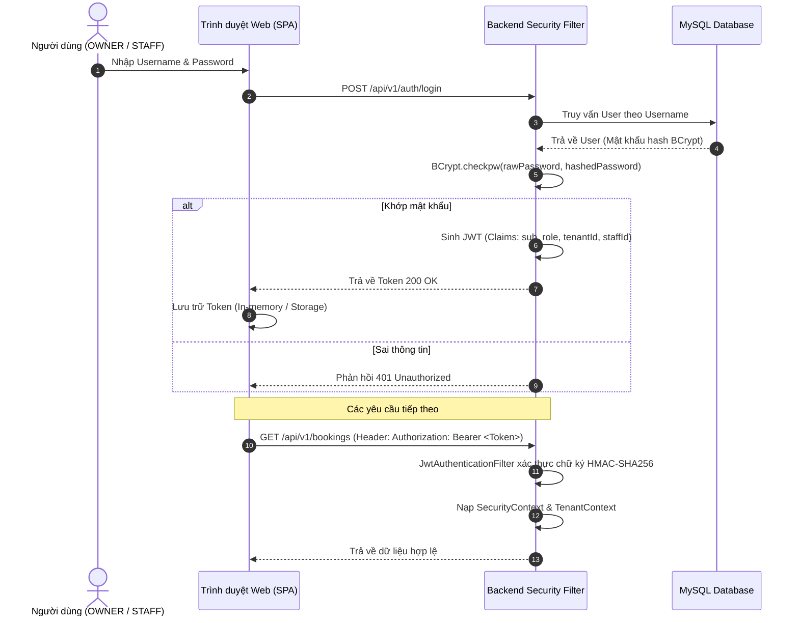

# Chính sách Bảo mật và Phân quyền (Security & Access Control)

Tài liệu này mô tả chi tiết các cơ chế an toàn thông tin, xác thực phi trạng thái, phân quyền dựa trên vai trò (RBAC), cô lập dữ liệu đa tenant và các giải pháp chống tấn công mạng được triển khai trên hệ thống **TIKEY SPA**.

---

## 1. Mô hình Xác thực Phi Trạng thái (Stateless Authentication)

Hệ thống sử dụng cơ chế xác thực **JSON Web Token (JWT)**, loại bỏ hoàn toàn việc lưu trữ session phía máy chủ:



### Chi tiết kỹ thuật:
- **Thuật toán ký token**: HMAC-SHA256 với khóa bí mật `JWT_SECRET` (bắt buộc độ dài tối thiểu 256 bits trong môi trường production).
- **Mã hóa mật khẩu**: Sử dụng **BCrypt Password Encoder** với Salt được tạo ngẫu nhiên cho từng tài khoản. Mật khẩu không bao giờ được lưu trữ ở dạng rõ (Plaintext) hoặc in ra log.
- **Thời hạn token**: Mặc định 24 giờ (`86400000 ms`), được kiểm soát thông qua biến `JWT_EXPIRATION_MS`.

---

## 2. Phân quyền Dựa trên Vai trò (Role-Based Access Control - RBAC)

Hệ thống định nghĩa 2 vai trò nội bộ và 1 đối tượng khách hàng công khai:

| Quyền hạn / Nghiệp vụ | Khách hàng vãng lai (Public) | Nhân viên (STAFF) | Chủ Spa (OWNER) |
| :--- | :---: | :---: | :---: |
| Xem landing page, danh mục dịch vụ | Cho phép | Cho phép | Cho phép |
| Tra cứu lịch trống & Đặt lịch hẹn | Cho phép | Cho phép | Cho phép |
| Tra cứu / Hủy lịch hẹn của bản thân bằng mã code | Cho phép | - | - |
| Gửi ý kiến phản hồi (Rate-limited) | Cho phép | - | - |
| Xem lịch làm việc & lịch hẹn cá nhân | - | Cho phép | Cho phép |
| Đổi trạng thái lịch hẹn cá nhân (Check-in, Start, Complete) | - | Cho phép | Cho phép |
| Tự cập nhật số điện thoại / email cá nhân | - | Cho phép | - |
| Xem Dashboard doanh thu tài chính toàn spa | - | **Bị cấm** | Cho phép |
| Xem lịch hẹn của nhân viên khác | - | **Bị cấm** | Cho phép |
| Chỉ định lại nhân viên thực hiện (Assign) | - | **Bị cấm** | Cho phép |
| Quản lý dịch vụ, giá tiền, danh mục | - | **Bị cấm** | Cho phép |
| Quản lý hồ sơ nhân viên, ca làm, ngày nghỉ | - | **Bị cấm** | Cho phép |
| Quản lý tài khoản, cấp phát & đặt lại mật khẩu | - | **Bị cấm** | Cho phép |
| Quản lý khách hàng & Xuất báo cáo Excel | - | **Bị cấm** | Cho phép |
| Thực hiện hoàn tiền & Đối soát VNPay QueryDR | - | **Bị cấm** | Cho phép |

### Cơ chế kiểm soát cấp phương thức (Method-level Security):
Các controller sử dụng annotation `@PreAuthorize` của Spring Security kết hợp kiểm tra nghiệp vụ trong service:
```java
// Ví dụ: Chỉ OWNER mới có quyền chỉ định nhân viên cho lịch hẹn
@PatchMapping("/{id}/assign")
@PreAuthorize("hasRole('OWNER')")
public ResponseEntity<BookingResponse> assignBooking(...) { ... }

// Ví dụ: STAFF bị hạn chế chặt chẽ chỉ được thao tác trên lịch hẹn của chính mình
if (isStaff && !booking.getStaff().getId().equals(currentUserStaffId)) {
    throw new AccessDeniedException("Nhân viên không có quyền thao tác trên lịch hẹn của người khác");
}
```

---

## 3. Cơ chế Cô lập Dữ liệu Đa Tenant (Multi-Tenant Data Isolation)

Dù hiện tại hệ thống tập trung phục vụ một cơ sở kinh doanh, cấu trúc dữ liệu và logic phần mềm đã được thiết kế tuân thủ nguyên tắc cô lập dữ liệu tuyệt đối:

1. **Gắn Tenant ID bắt buộc**: Mỗi bảng nghiệp vụ trong cơ sở dữ liệu (`bookings`, `customers`, `staff`, `services`, `payments`, ...) đều có cột `tenant_id` làm khóa ngoại.
2. **Quản lý ngữ cảnh qua ThreadLocal**: Lớp `TenantContext` lưu trữ `tenant_id` độc lập cho từng luồng thực thi (Thread).
3. **Mệnh đề WHERE bắt buộc**: Mọi truy vấn Spring Data JPA đều bắt buộc chứa điều kiện `WHERE b.tenant.id = :tenantId`.
4. **Không rò rỉ luồng**: Bộ lọc `TenantContextFilter` luôn thực thi lệnh `TenantContext.clear()` trong khối `finally` sau khi kết thúc chu trình xử lý HTTP request.

---

## 4. Chống Tấn công và Giả mạo IP (Network Security & Anti-Spoofing)

### 4.1. Giải mã IP Client và Chống giả mạo Header (`ClientIpResolver`)
Khi ứng dụng vận hành phía sau Reverse Proxy (Cloudflare hoặc Nginx), địa chỉ socket trực tiếp kết nối tới máy chủ sẽ là địa chỉ IP của proxy. Kẻ tấn công có thể cố tình gửi kèm header `X-Forwarded-For` giả mạo nhằm né tránh giới hạn Rate Limit.

Hệ thống bảo vệ bằng quy trình:
1. Trích xuất địa chỉ IP trực tiếp của kết nối mạng (Remote Socket IP).
2. Kiểm tra xem IP kết nối có thuộc danh sách proxy tin cậy (`SECURITY_TRUSTED_PROXIES` - bao gồm `127.0.0.1`, `::1` và dải private RFC 1918 `10.0.0.0/8`, `172.16.0.0/12`, `192.168.0.0/16`) hay không.
3. **Nếu kết nối đến từ Proxy tin cậy**: Hệ thống mới đọc header `CF-Connecting-IP` hoặc phần tử ngoài cùng của `X-Forwarded-For`.
4. **Nếu kết nối đến từ nguồn không tin cậy**: Hệ thống hoàn toàn phớt lờ các header chuyển tiếp và sử dụng chính Remote Socket IP để định danh máy khách.

### 4.2. Giới hạn tần suất yêu cầu (Rate Limiting)
Lớp `RateLimitFilter` áp dụng thuật toán Fixed Window bộ nhớ trong:
- **Đăng nhập (`/api/v1/auth/login`)**: Tối đa 10 lần thử / phút trên mỗi IP nhằm ngăn chặn tấn công từ điển (Dictionary Attack).
- **Góp ý (`/api/v1/public/**/feedback`)**: Tối đa 5 lần gửi / phút trên mỗi IP nhằm ngăn chặn spam nội dung rác.
- **Yêu cầu hoàn tiền (`/api/v1/refunds`)**: Tối đa 15 yêu cầu / phút trên mỗi IP.
- Khi vượt ngưỡng, hệ thống lập tức phản hồi mã trạng thái `HTTP 429 Too Many Requests` kèm thông báo `{"status":429,"error":"Too Many Requests","message":"Rate limit exceeded"}`.

---

## 5. An toàn Giao dịch và Chống Xử lý Lặp VNPay (Payment Security)

Tích hợp cổng thanh toán VNPay được thiết kế với tiêu chuẩn an toàn cao:

1. **Kháng tấn công thời gian (Timing-Attack Resistant)**: Việc so sánh chữ ký số băm HMAC-SHA512 giữa dữ liệu nhận từ VNPay và dữ liệu tính toán cục bộ được thực hiện bằng hàm so sánh thời gian cố định `MessageDigest.isEqual(...)`, ngăn ngừa kẻ tấn công suy đoán chữ ký qua chênh lệch thời gian phản hồi micro-giây.
2. **Xác thực số tiền phía máy chủ (Server-authoritative Amount Validation)**: Trước khi cập nhật trạng thái thanh toán thành công, hệ thống đối soát chính xác số tiền `vnp_Amount` nhận được với số tiền thực tế lưu trong bản ghi `Payment` ở CSDL (có chia cho 100 theo quy định của VNPay). Nếu sai lệch, hệ thống trả về mã lỗi `RspCode: "04"` (Invalid Amount).
3. **Cơ chế chống xử lý lặp (Idempotent Notification Handling)**: Khi máy chủ VNPay gửi thông báo IPN lặp lại cho giao dịch đã đạt trạng thái cuối cùng (`PAID`), hệ thống phản hồi `{"RspCode":"02","Message":"Order already confirmed"}` mà không kích hoạt lại các hiệu ứng phụ (không cập nhật lại trạng thái booking, không cộng dồn tiền).
4. **Bảo toàn trạng thái cuối (No Status Regression)**: Một giao dịch đã ở trạng thái `PAID` tuyệt đối không bao giờ bị chuyển đổi ngược về `FAILED` hoặc `CANCELLED`.

---

## 6. Tiêu chuẩn Security Headers

Backend Spring Boot thiết lập nghiêm ngặt các header bảo mật HTTP cho mọi phản hồi:
- **Content-Security-Policy (CSP)**: `default-src 'none'; frame-ancestors 'none'; base-uri 'none'`
- **X-Frame-Options**: `DENY` (Chống tấn công Clickjacking / Iframe hijacking).
- **Strict-Transport-Security (HSTS)**: `max-age=31536000; includeSubDomains` (Bắt buộc trình duyệt chỉ dùng HTTPS).
- **Referrer-Policy**: `no-referrer` (Không làm lộ đường dẫn URL nội bộ sang website bên ngoài).
- **Permissions-Policy**: `camera=(), microphone=(), geolocation=()` (Vô hiệu hóa quyền truy cập phần cứng nhạy cảm).

---

## 7. Báo cáo Kiểm toán Bảo mật Chi tiết

Để xem xét các kết quả đánh giá lỗ hổng chi tiết và danh mục các điểm khắc phục kỹ thuật đã được kiểm chứng thực tế, vui lòng tham khảo các tài liệu chuyên sâu:
- [Báo cáo Kiểm toán Bảo mật Toàn diện (SECURITY_AUDIT_REPORT.md)](security/SECURITY_AUDIT_REPORT.md)
- [Bảng Kiểm tra Khắc phục và Gia cố Bảo mật (SECURITY_HARDENING_CHECKLIST.md)](security/SECURITY_HARDENING_CHECKLIST.md)
